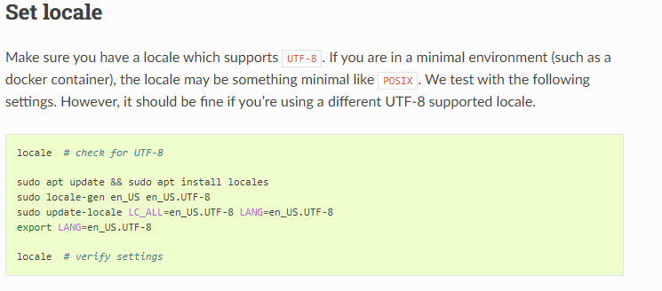
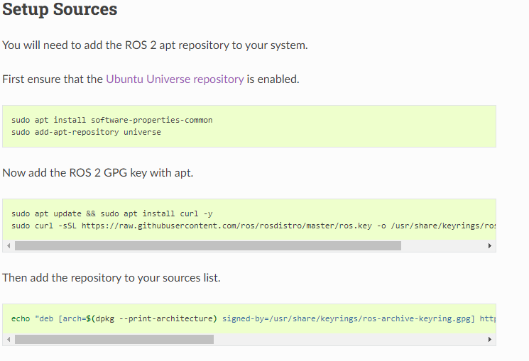
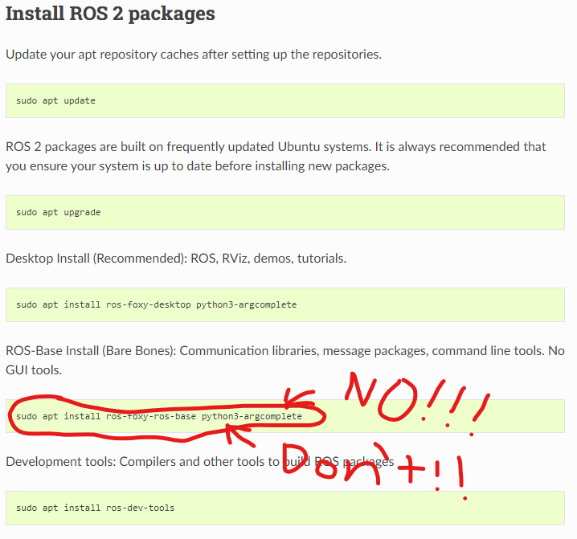

# Intro Project
## Download Ubuntu 20.04
You can use a virtual machine, dual boot, or completely wipe an os from an old device and put Ubuntu on it.

I recommend to put:

at least 8 gigs of RAM

80 gigs or storage is a safe bet

any number of processors will do the more the better

<br>

## ROS 2 Foxy Documentation Page
#### This process will be done on your ubuntu machine
Start by right clicking and opening the following link in a new tab [ROS2 Foxy Documentation](https://docs.ros.org/en/foxy/index.html)

Click on the tab and it should look like this:


On the left side of this page you will see some tabs that are pretty self explanatory

However for the purpose of doing the intro project:

Go to the tab **Installation** and click on it

It will then tab down a list of installation types

You will click on **Ubuntu (Debian)**

Your page should now look like this:


## Installing ROS2 Foxy

##### Putting the commands in order of the layout of the page is vital

### Set locale
Starting at the section **Set locale** on that page follow the steps pasting those commands into a terminal on your ubuntu machine



### Setup Sources
Copy and paste all these commands into yout terminal on your ubuntu machine



### Install ROS 2 packages
##### VERY IMPORTANT
When you come to the **Install ROS 2 packages** portion of the install process:

**DO NOT** use the command:
```
sudo apt install ros-foxy-ros-base python3-argcomplete
```



All other commands in that section are okay to use

### Environment setup
After you have done all the previous steps you now have Ros on your device.
When you want to use Ros within a terminal you must source your environment with ros this is done by using this command:
```
source /opt/ros/foxy/setup.bash
```
However, it could get tiring having to type that command everytime you open a terminal that you want to use ros in. To automate the process of opening a terminal that already has Ros sourced you can do this just one time and all future terminals will have Ros sourced:

Go into a terminal on your Ubuntu machine and type or copy and paste this command

```
echo 'source /opt/ros/foxy/setup.bash' >> ~/.bashrc
```
then type/copy&paste this command

```
source ~/.bashrc
```
close that terminal and move to the last section you will be focused on with ROS2 Installation process **Try some examples**

Try the examples on the page to make sure everything is working properly

Once you have gotten here you can do one of two things:


1. You can move on to the youtube tutorials that will teach you how to make nodes, topics, and services (the intercommunication of the robot) **(REQUORED FOR INTRO PROJECT)**

This is the [Youtube Playlist](https://www.youtube.com/playlist?list=PLLSegLrePWgJudpPUof4-nVFHGkB62Izy) you will follow **STARTING AT VIDEO 3: Create and Set up a ROS2 Workspace - ROS2 Tutorial 3** and finish the entire playlist ending at Tutorial 11.
Yes, his ROS is ROS 2 Humble not ROS 2 Foxy, however all the code and enviroment setup is the same. He just uses a different Ubuntu version which requires a different ROS 2 version.

**Please** use the same folder and variable names he does in the video as it will make it easier for me to test your code and environment.


## EXTRA FOR MORE PRACTICE
2. You can take a look at the **Tutorials** tab on the left side of the ROS doucmentation page **(THIS IS NOT A REQIREMENT OF THE INTRO PROJECT)**
If you would like to just go through the whole Tutorial section there and practice feel free

Some good sections to look at to get and understanding of nodes, topics ,and services can be found in:

tutorials > Beginner: CLI tools > Understanding nodes
tutorials > Beginner: CLI tools > Understanding topics
tutorials > Beginner: CLI tools > Understanding services

Feel free to practice with the ROS turtlesim 
   


