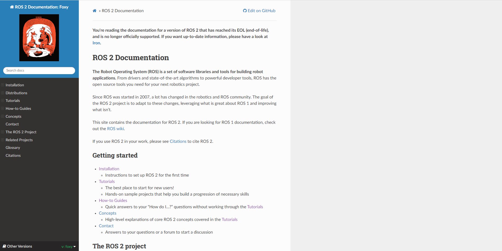
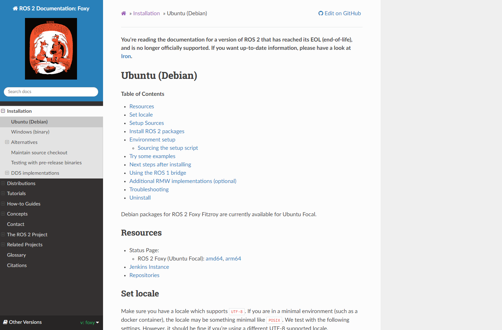

# Intro Project
### Download Ubuntu 20.04
You can use a virtual machine, dual boot, or completely wipe an os from an old device and put Ubuntu on it.

I recommend to put:

at least 8 gigs of RAM

80 gigs or storage is a safe bet

any number of processors will do the more the better

 

### Download ROS 2 Foxy
#### This process will be done on your ubuntu machine
Start by right clicking and opening the following link in a new tab [ROS2 Foxy Documentation](https://docs.ros.org/en/foxy/index.html)

Click on the tab and it should look like this:

On the left side of this page you will see the tab Installation **Click on it**

It will then tab down a list of installation types

You will click on **Ubuntu (Debian)**

Your page should now look like this:

